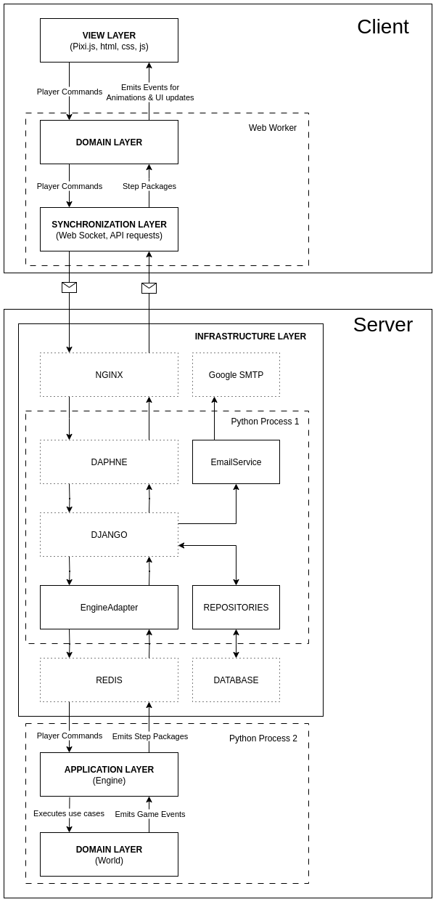

This is a multiplayer game about the evolution of ant species. The main goal is to breed your own species through selection, adapting it to the environment and enabling it to dominate the species of other players. The game mechanics are based on real-world principles of ant genetics, including mechanisms of genomes, chromosomes, meiosis, gene dominance, etc. This allows players to influence the evolution of their species by changing the characteristics of individual ants, such as strength, combat resistance, lifespan, and others. The game also simulates the life of colonies with different ant castes (workers, soldiers, females, and males) and their behavior, which is controlled by pheromones. The environment is dynamic and changes with four seasons, which affects resource availability and requires constant adaptation.

Detailed information on genetics and gameplay is available in the in-game help.

* **Game Website:** [https://evolutionofants.click/](https://evolutionofants.click/)
* **Gameplay Video:** [YouTube Video](https://www.youtube.com/watch?v=fMoLUvllM98)

### **How It Works**

It runs directly in a web browser, and is fully playable on both desktop and mobile devices.

In the game, living entities have a body, mind, and thoughts. The mind controls the execution of thoughts, which in turn control the body. This is a Strategy pattern, where thoughts are the strategies. The mind selects the appropriate thoughts for the circumstances. For example, when an ant feels hungry, the mind queues up the thought that it needs to eat. Or when an enemy is nearby and attacking, the mind cancels less prioritized thoughts and creates a thought about defending itself.

Every time interval, the entire game world takes a step. Currently, one step takes one second to execute. This parameter can be easily changed to improve performance. With each step, certain game events occur. These events are collected, and from them, domain model change packages, called step packages, are formed for each player. Each step package contains information about common events (ant movements, season changes, nest building, etc.) and player-specific ones (the progress of eggs developing in the nest, player notifications, etc.). These packages are then passed through Redis to the process where Django is running. From there, these packages are sent via WebSockets to the browser of each online player. On the client side, these packages are received by a web worker. First, the changes from the package are applied to the world model that exists on the client side. After that, a new package is formed, which contains information about animations and player-specific changes. For optimization, this package is formed based on the player's current view position. Then, the package is passed to the view layer. At this layer, animations are played using Pixi.js, and the state of the player's panel is updated. The diagram below illustrates the path of data through the system.

### **Performance Tests**

* **4K Ants Test:** [YouTube Video](https://www.youtube.com/watch?v=fsOqnIcIcdM)
  _Note: See video description on YouTube for test conclusions._
* **8K Ants Test:** [YouTube Video](https://www.youtube.com/watch?v=vmhddQBWWTw)

### **Development Showcase**

* **Early Stages of Development:** [YouTube Video](https://www.youtube.com/watch?v=pUTJYvNdoUg)
