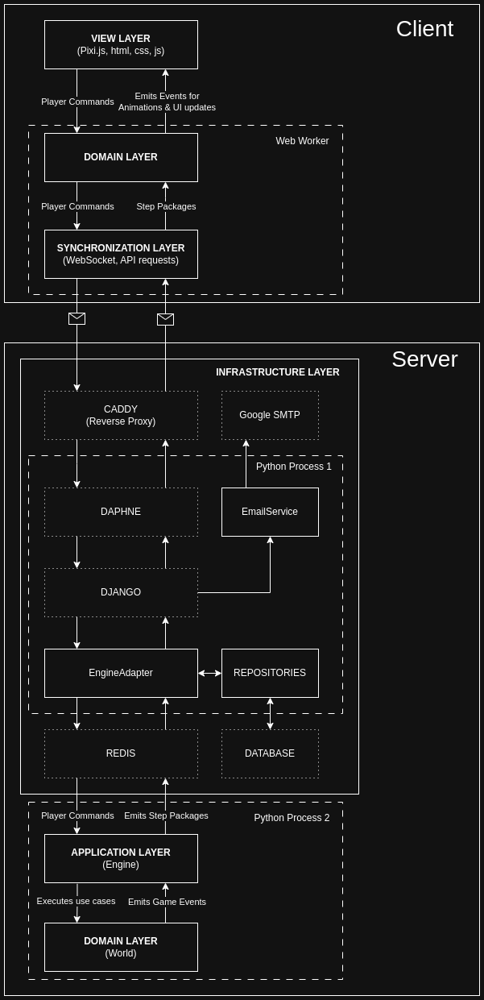

<h1 align="center">🐜</h1>

Evolution of Ants is a real-time simulation of ant evolution. Each user can selectively breed their own ant species, gradually developing unique characteristics that allow it to adapt and potentially dominate over species maintained by other users. All interactions take place within a shared online environment featuring dynamic seasonal cycles that affect food availability and overall ecological stability. The primary emphasis of the project is on biologically grounded modeling and the accurate reproduction of evolutionary mechanisms.

The biological model in Evolution of Ants reproduces the real principles of genetics and social behavior observed in natural ant colonies. Every ant has genes inherited from its parents, and those genes determine various traits, such as HP, strength, appetite, visibility range, and many others. What makes the model complex is that the inheritance mechanism is biologically accurate: genes are grouped into chromosomes, forming a full genome, and passed through a meiosis-like process that includes recombination, gene dominance, and random mutations with configurable mutation rates. Each individual is diploid (two sets of chromosomes), while gametes are haploid, so offspring receive a genetically realistic mix of traits from both parents. This allows natural selection and selective breeding to work exactly like in real ant populations. On the colony level, there’s also modeling of pheromone signaling, castes (workers, soldiers, males, females, and queens), colony interactions, and resource gathering.

## Enter the World

It runs directly in a web browser and works smoothly on both 🖥️ desktop and 📱 mobile devices.

🎮 **Open Web Version:** [https://evolutionofants.click](https://evolutionofants.click/) 
🎥 **Demo Video:** [YouTube Video](https://www.youtube.com/watch?v=fMoLUvllM98)

## System Architecture and Data Flow

The diagram below illustrates the overall architecture and data flow within the application.

## Architecture Description
This architecture is designed to ensure high performance and reliability under real-time simulation conditions, following the principles of Clean Architecture and process separation on the server and client.

### ⚙️ Server Architecture
On the server side, the code follows Clean Architecture and is divided into three logical layers that form two separate processes to ensure stability and scalability.

#### Simulation Core
The Application Layer and Domain Layer constitute the simulation core. They run in a separate process(Python Process 2 on the diagram).

* **Domain Layer:** Contains the pure, independent business logic(simulation entities' behavior, environment changes, genetics, etc.). This logic runs in an infinite loop, where each simulation iteration occurs once per second and every simulation entity performs its action.
* **Application Layer:** This is the outer layer of the simulation core. The Engine class lives here and manages the execution of incoming commands using data serialization and deserialization, and invoking services from the Domain Layer.

#### Outer Layer
* **Infrastructure Layer:** This is the outer layer responsible for communication with the external world and resource management. This is where HTTP requests and WebSocket connections are handled, along with database management, email sending, and communication with the simulation core via the EngineAdapter, which uses a Redis channel(pub/sub) for message exchange.

**Key Solution:** The placement of the simulation core(Domain + Application Layers) in a separate process(Python Process 2) prevents the web server's operations such as HTTP request processing or database queries from affecting the stability and performance of the Engine and the simulated world.

### 💻 Client Architecture
On the client side, the code follows Clean Architecture principles and is divided into three logical layers. This is a three-layer variant of Clean Architecture, adapted for the frontend context where the application layer is omitted because orchestration is minimal and performed directly by the domain layer.

_Note on dependencies: The diagram above shows data flow, not dependency direction. To maintain Clean Architecture, functionality from the Synchronization Layer is injected into the Domain Layer, ensuring its independence from external concerns._

* **View Layer:** Contains DOM elements and is responsible for rendering graphics(Pixi.js) and all visual components(HTML, CSS, JS).

* **Domain Layer:** The client-side domain model lives here. It stores the world state, contains the business logic of the client application and processes step packages(packages with state changes).

* **Synchronization Layer:** The layer responsible for communication with the server. It receives step packages and sends user commands to the server via WebSocket.

**Key Solution:** The Domain Layer and Synchronization Layer run in a separate thread(Web Worker). This is necessary to decouple model processing from rendering. While the domain layer updates the model, the browser's main thread remains free for smooth animation performance.

### 🧩 How It Works

Every time interval, the entire simulation world takes a step. With each step, certain simulation events occur. These events are collected, and from them, so-called "step packages" are formed for each user. Each step package contains information about common events(ant movements, season changes, nest building, etc.) and user-specific ones(the progress of eggs developing in the nest, user notifications, etc.). Then these packages are passed through Redis to the EngineAdapter(within Python Process 1 on the diagram) and then via WebSockets to the browser of each online user. On the client side, these packages are received by the Synchronization Layer(within Web Worker on the diagram). First, the package is applied to the client domain model. After that, a new view update package is formed, which contains information about animations and user-specific UI changes. For optimization, this view update package is formed based on the user's current view position on the map. Then, it is passed to the view layer, where animations are played and the state of the user's panel is updated.

But what is happening in the ant's head during this process? Any living entity has a body, mind, and thoughts. The mind controls the execution of thoughts, which in turn control the body. This is a Strategy pattern, where thoughts are the strategies. The mind selects the appropriate thoughts for the circumstances. For example, when an ant feels hungry, the mind queues the thought that it needs to eat. Another example is when an enemy is nearby and attacking, the mind cancels lower-priority thoughts and creates a thought about defending itself.

### Composition Roots: 
* [Engine](https://github.com/adevianin/bugs/blob/master/bugs/engine_start.py)
* [Engine Adapter](https://github.com/adevianin/bugs/blob/master/bugs/main/init.py)
* [Client App](https://github.com/adevianin/bugs/blob/master/bugs/client/gameApp/src/index.js)

## 🛠️ Tech Stack
* **Client side**: JavaScript, Pixi.js/WebGL, Web Worker, WebSocket, Webpack
* **Server side**: Python 3, Django 5, Redis(as IPC), Multiprocessing(Custom Simulation Engine), Google OAuth 2.0 & SMTP, Docker, Caddy 2, SQLite(since RAM limit on free VPS)

## 🚀 Performance Tests

* **Test with ~4K Ants:** [YouTube Video](https://www.youtube.com/watch?v=fsOqnIcIcdM) 
_Note: See video description on YouTube for test conclusions._
* **Test with ~8K Ants:** [YouTube Video](https://www.youtube.com/watch?v=vmhddQBWWTw)

## 💡 Development Showcase

* **Early Stages of Development:** [YouTube Video](https://www.youtube.com/watch?v=pUTJYvNdoUg)
